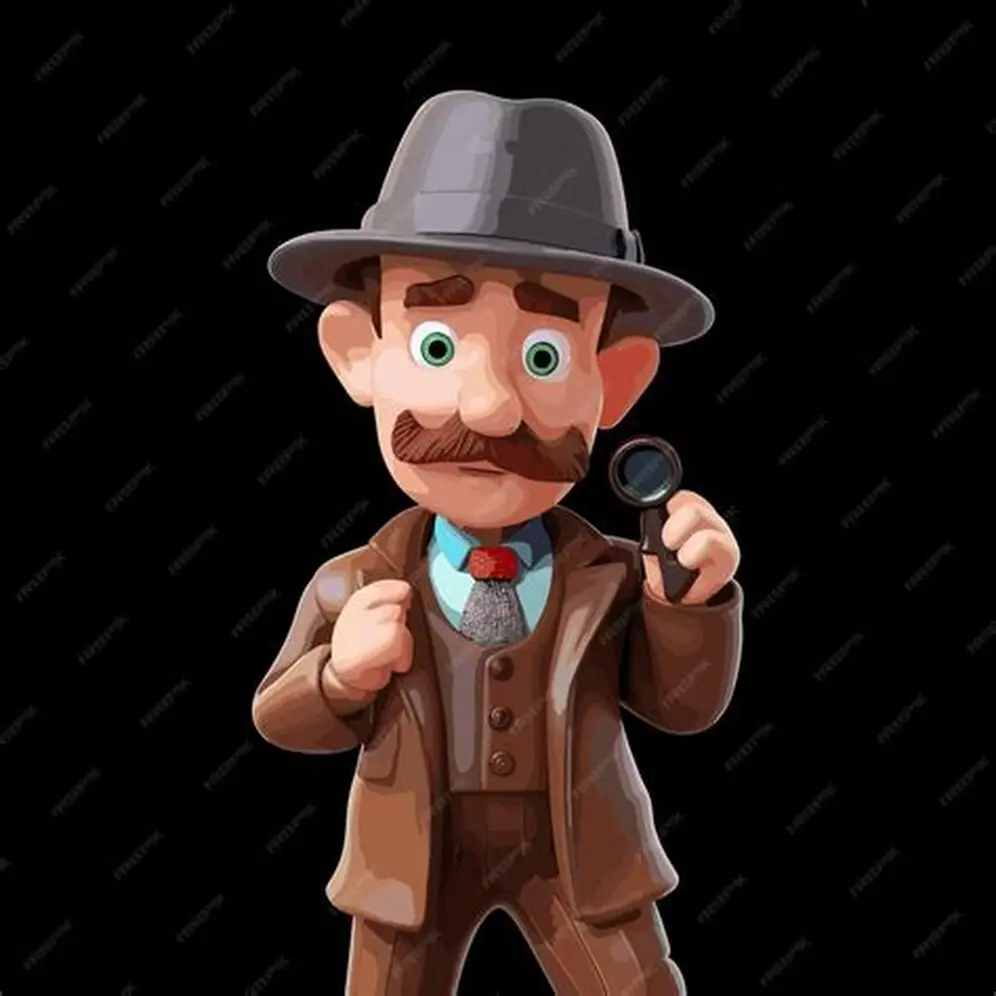

# 🕵️‍♂️ Riddle Detective Game

A fun and interactive detective riddle game where players solve mysterious cases by analyzing clues, characters, and events. Built using pure **HTML**, **CSS**, and **JavaScript** – no frameworks required.


---

## 🔍 Description

**Riddle Detective** is a logic-based Arabic riddle game inspired by detective puzzles like "Inspector Crombo" and similar shows.  
Each riddle contains:
- A **title**
- A **case event**
- A list of **suspects**
- Multiple **clues**
- A **question**
- Several **answer choices**
- And a **logical analysis** explaining the correct answer

---

## ✨ Features

- ✅ Over 50 challenging riddles
- 📚 Each riddle with unique story and logic
- 🧠 Encourages critical thinking
- 📱 Responsive design (mobile-friendly)
- 💾 Score tracking using localStorage
- 🧩 Clean UI using TailwindCSS classes (optional)
- 🔁 Smooth transitions and animations

---

## 📸 Screenshots

| Homepage               | Riddle Page              | Correct Answer           |
|------------------------|--------------------------|--------------------------|
|  |  |  |

---

## 🛠️ Tech Stack

- HTML5
- CSS3 / TailwindCSS
- JavaScript (ES6+)
- LocalStorage API

---

## 🚀 How to Run Locally

1. Clone this repo:
   ```bash
   git clone https://github.com/yourusername/riddle-game.git
   cd riddle-game
